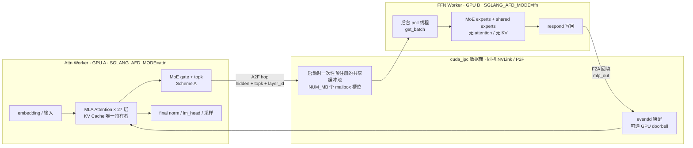
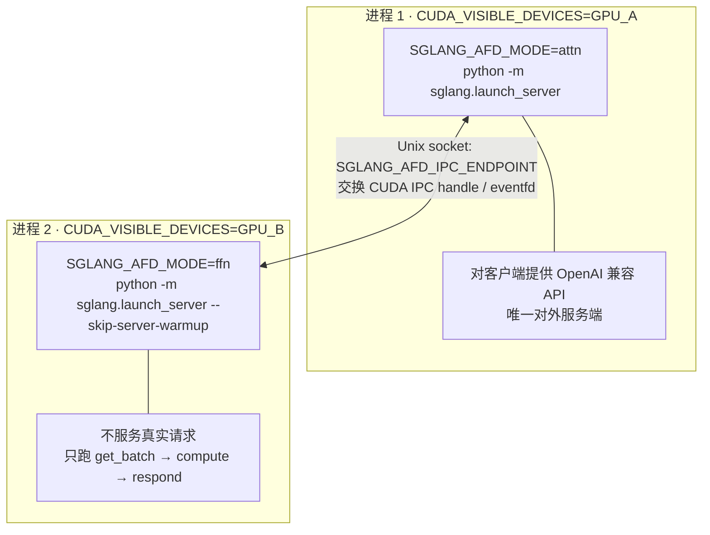
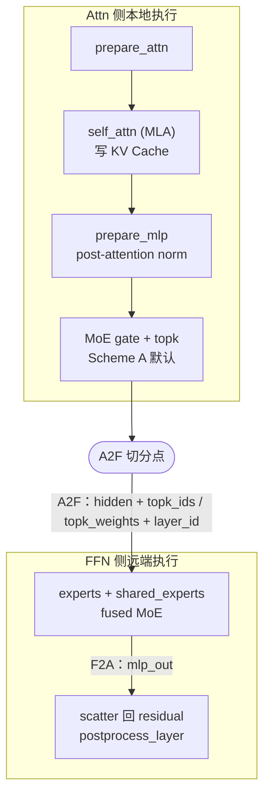
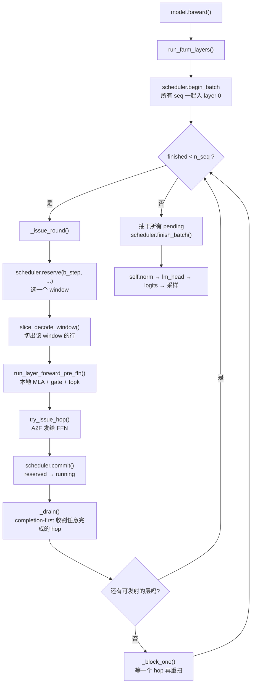
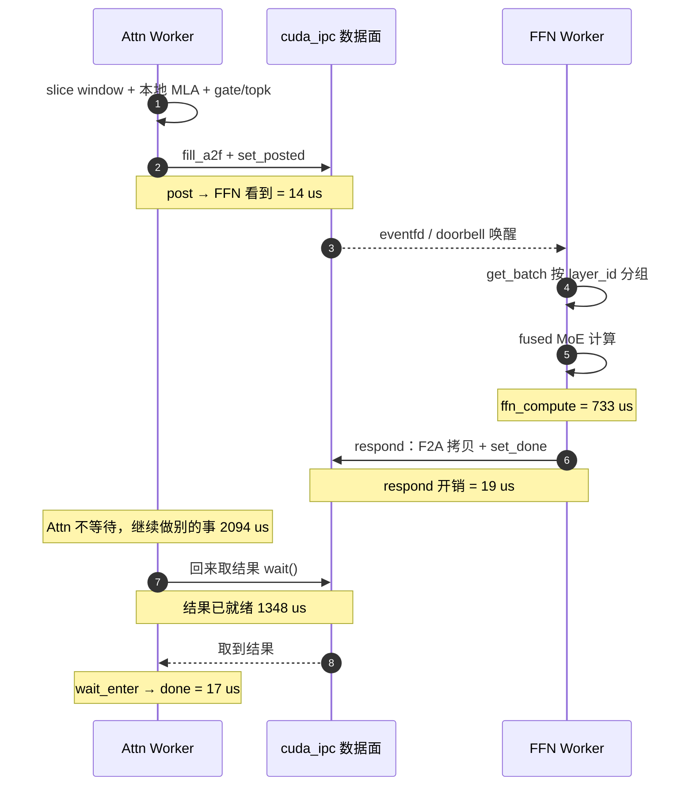
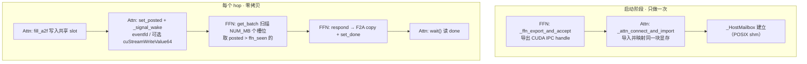
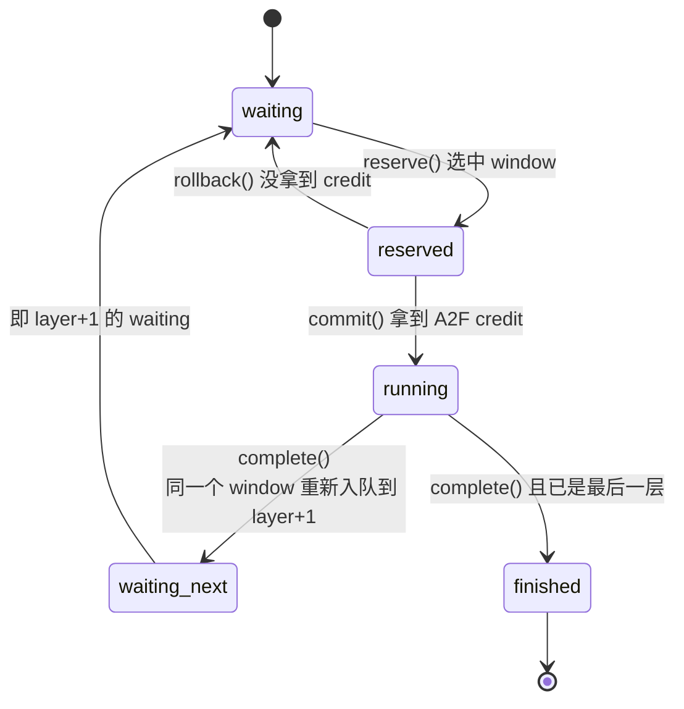
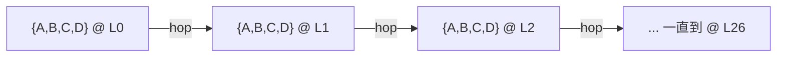
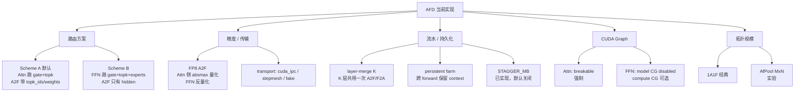
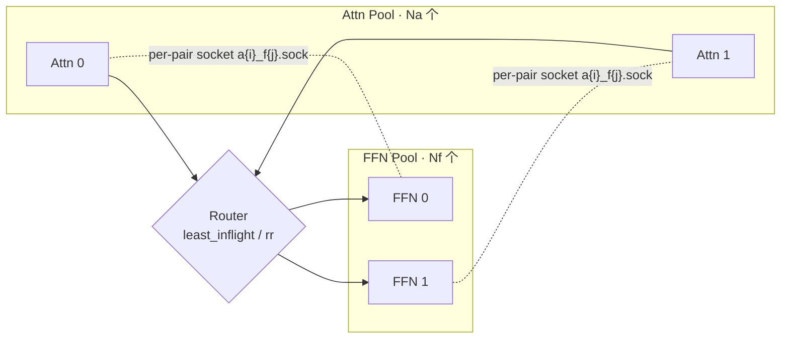

# SGLang Attention–FFN 分离（AFD）架构汇报

> **范围**：当前仓库中**正在运行**的实现 —— decode farm over `cuda_ipc`（含 AfPool MxN 实验路径）。
> **时点**：`HEAD = 9b6135cdcb`（decode farm 各阶段已全部落地，阶段编号见 `progress.md` §1–§22）。
> **配套**：结构文字说明见 `AFD_ARCHITECTURE.md`；全部实测数字与复现脚本见 `progress.md`。
> **编号约定**：本文小节编号为 §0–§13；文中出现的 §14 及之后的编号（如 §19.2、§22.3）
> 均指 `progress.md` 的对应小节，即原始实测数据的出处。
> **一句话概述**：AFD 的**数据面已完整打通且开销极低**（hop 传输 14 µs / 19 µs）；
> 当前 TPOT 的主要构成是 **Attn 侧 host 工作**，这也是下一步设计改进的着力点。
> 全文按「架构 → 控制流 → 数据契约 → 开销分布 → 设计空间」展开，末尾给出杠杆清单。

---

## 0. 一页纸总览

### 0.1 总拓扑



### 0.2 五条核心结论

1. **按角色切分，不是按层区间切分。** Attn 侧拥有 embedding、全部 27 层 MLA、gate/topk、norm/lm_head/采样与 KV Cache；FFN 侧只有 experts。两侧各自只构建自己需要的模块（`module_stubs.py`）。
2. **hop 是"一层一次、整批一起走"的。** `begin_batch` 把所有 seq 一起放进 layer 0，`complete` 又把**同一个 window** 塞进 `layer+1`，因此单 batch 下每层**恰好一个 hop 在飞** → `layers_peak = 1`；跨层并存要多 context 形态才会出现。
3. **hop 的传输本身几乎免费。** A2F 投递 14 µs，F2A 回写 19 µs，`a2f_sync` 4 µs；FFN 侧真算 MoE 约 733 µs。
4. **hop 已被高度隐藏。** Attn 发完 hop 后还会做 **2094 µs** 的其它工作才回来取结果，而结果早已就绪 **1348 µs**。因此开销的主战场在 **Attn 侧 host 路径**，而不是通信或 FFN 计算。
5. **Attn 侧约 39% 的 farm 时间是 per-hop 张量编组**（切 window、切 `SamplingBatchInfo`、拼 A2F 载荷），这是当前最直接的优化对象。

### 0.3 关键数字速览

| 维度 | 数值 | 来源 |
|---|---|---|
| 模型切分 | 2 进程 / 2 GPU，27 层 MLA 在 Attn，27 层 MoE 在 FFN | §2 |
| 单 hop 网络载荷 | 14 µs（Attn→FFN），19 µs（FFN→Attn） | §19.2 |
| FFN 侧 MoE 计算 | ~733 µs/hop（GPU 只用 738 µs，CPU 1628 µs） | `progress.md` §13 / §19.2 |
| hop 隐藏量 | 结果就绪后 1348 µs 才被取走 | §19.2 |
| Attn 侧 host 编组占比 | ~39%（attention 只占 35.4%） | §19.3 |
| 已落地累计收益 | +42.8% tok/s，−26.8% TPOT（同一配置链） | §15.8 |
| 待压缩空间 | Attn host 编组 ~39% + 每-hop 固定成本 `f` | §19.3 / §8.2 |

---

## 1. 为什么做 AF 分离

Decode 阶段的两种负载性质完全相反：

| | Attention（MLA） | FFN / MoE |
|---|---|---|
| 显存 | **KV Cache 主导**，随并发线性膨胀 | 权重主导 |
| 算力 | 访存密集、batch 不敏感 | 计算密集，大 M 才划算 |
| 扩容方式 | 加显存 / 加实例 | 加算力 |

把它们**放在同一张卡上**，两者的扩容诉求互相绑架。AF 分离（AFD）把 Attention 与 FFN 放进**两个独立实例池**，中间交换 activation：

- 各自可以**独立扩容**；
- Attn 侧不再为 MoE 权重预留显存，KV 可以放更多；
- FFN 侧可以专门吃大 batch。

> **与 PD 分离的区别**：PD（prefill/decode disaggregation）搬的是 **KV Cache**；
> AFD 搬的是 **activation（hidden states + routing）**。代码里用独立的 `AfdMode` 枚举，
> 不与 `DisaggregationMode` 混用（`mode.py`）。

---

## 2. 总体拓扑：按角色切分

### 2.1 两个进程、两种角色



| 事实 | 说明 |
|---|---|
| 真跑起来是**两个 `launch_server`** | FFN 先起（`AFD cuda_ipc FFN waiting`），Attn 后起并做 health check |
| FFN 是**被动服务端** | 由后台 poll 线程驱动，永远不接客户端请求 |
| 两侧**共享同一份模型权重文件**，但只加载各自需要的部分 | `SGLANG_AFD_RELEASE_UNUSED_PARAMS=1` 可把用不到的权重挪到 CPU |
| GPU 间通信 | 同机 `cuda_ipc`（NVLink / P2P）；跨机可切 `stepmesh`（RDMA） |

### 2.2 一个 Decoder Layer 的归属



**residual 永远留在 Attn 侧**，不上下行（只有 layer-merge 模式例外）。这是 RFC 里定死的设计决策。

### 2.3 模块 stub：各建各的

`module_stubs.py` 让两侧只构建自己需要的模块，直接省显存：

| 角色 | 构建 | stub 掉（不构建） |
|---|---|---|
| **Attn**（Scheme A） | `self_attn` (MLA) + `gate` + `topk` | MoE `experts` / `shared_experts` / dense MLP body |
| **Attn**（Scheme B） | `self_attn` (MLA) | 整个 `mlp`（连 gate/topk 都在 FFN） |
| **FFN** | MoE `experts` / `shared_experts`（+ Scheme B 的 gate/topk） | `self_attn`（**省下的正是 KV 显存**） |
| 被 stub 的模块 | —— | 换成 `AfdMissingModule`，一旦被调用立刻报错 |

> FFN worker 因此**没有任何 KV Cache**，`SGLANG_AFD_MAX_NUM_TOKEN` 也不需要按 CG bucket 放大。

---

## 3. 一次 decode step 的控制流

入口在 `deepseek_v2.py`：原本的 `for layer in layers: layer(...)` 被替换成对
`layers[normal_start_layer:normal_end_layer]` 调用 `run_farm_layers(...)`。



### 两个关键性质

| 性质 | 含义 |
|---|---|
| **completion-first** | `_drain` 收割的是**最先完成**的 hop（`poll_hop` 扫全部 pending），不是 `pending[0]`。单个慢 hop 不会堵住整个波前。 |
| **credit 门控，不是定时器** | `AttnSendQueue` 只有在**下游 credit 允许**时才取出一组发送；发不出去就 `rollback()` 还给调度器，不做超时等待。 |

流动的 window 长这样：

```
batch（全部 seq）
  → [layer L]  Attn（本地 MLA）+ MoE gate/topk（本地）
  → A2F hop → FFN（远端 experts）→ F2A
  → [layer L+1] ...
```

---

## 4. 单个 hop 的端到端时序（实测）

这是整份汇报**最重要的一张图**：它证明 hop 不在关键路径上。



| 相位 | p50 | 谁 | 读法 |
|---|---:|---|---|
| `post_to_ffn_us` | **14 µs** | 传输 | 网络/唤醒几乎免费 |
| `ffn_compute_us` | 733 µs | FFN | 真算 MoE |
| `ffn_to_respond_us` | **19 µs** | 传输 | F2A 拷贝 + doorbell 免费 |
| `respond_to_wait_enter_us` | **1348 µs** | Attn | **结果就绪后闲置** |
| `wait_enter_to_done_us` | **17 µs** | Attn | 取走极快 |
| `total_rt_us` | 2135 µs | | 全程往返 |

> **结论**：`post → wait_enter` 之间 Attn 自己跑了 **2094 µs**。**hop 被完全隐藏**，
> 砍掉整个 FFN 也省不下 TPOT。§16.4 早期把 2297 µs 当成"串行 rtt"是错的，已在 §19 更正。

---

## 5. Hop 协议：线上到底传了什么

### 5.1 32-bit key 的位域（StepMesh 兼容）

```
bit  0–7   private_key   tensor 槽位号（见下表）
bit  8–15  microbatch    mb_id
bit 16–23  worker_rank   Attn worker 序号
bit 24     direction     0 = A2F / push, 1 = F2A / pull
```

### 5.2 A2F / F2A 载荷

| 方向 | 槽位 | 名称 | 形状 | dtype | 备注 |
|---|--:|---|---|---|---|
| A2F | 0 | `hidden` | `[T, H]` | bf16 / fp16 / **fp8** | `prepare_mlp` 之后的 hidden |
| A2F | 1 | `num_tokens` | `[1]` | int32 | 真实长度（T 会 pad 到 bucket） |
| A2F | 2 | `layer_id` | `[1]` | int32 | layer-merge 时高 8 位放 `merge_k` |
| A2F | 3 | `topk_ids` | `[T, K]` | int32 | **Scheme A 专有** |
| A2F | 4 | `topk_weights` | `[T, K]` | fp32 | **Scheme A 专有** |
| A2F | 5 | `hidden_scale` | `[1]` | fp32 | wire dtype = fp8 时存在 |
| A2F | 6 | `residual` | `[T, H]` | compute | 仅 layer-merge |
| A2F | 7 | `positions` | `[T]` | int64 | 仅 layer-merge |
| **F2A** | 0 | `mlp_out` | `[T, H]` | compute | MoE 输出 |
| **F2A** | 1 | `residual` | `[T, H]` | compute | 仅 layer-merge |

### 5.3 缓冲池：热路径零分配

`AfdBufferPool` 在启动时一次性分配

```
NUM_MB × ( max_num_token × hidden_size )   ← A2F hidden（wire dtype）
NUM_MB × ( max_num_token × hidden_size )   ← F2A mlp_out（compute dtype）
+ 每槽位的 num_tokens / layer_id / topk_ids / topk_weights / scale
```

热路径只做 `copy_`（`fill_a2f`），**绝不 `torch.empty`**。`hidden` 超长会立刻抛错并提示抬高
`SGLANG_AFD_MAX_NUM_TOKEN` —— 这是**唯一的 OOM 开关**。

---

## 6. 传输层：cuda_ipc



| 机制 | 作用 |
|---|---|
| **预注册 + IPC 映射** | 张量内存在启动时共享；`_zero_copy` 路径下每 hop **没有 tensor 拷贝** |
| **`NUM_MB` 个 mailbox 槽位** | 提供多个**独立在飞**槽位；`mb_id` 选择其一。默认 2，farm 下自动抬到 `MAX_INFLIGHT` |
| **`_HostMailbox`** | 承载 `posted` / `done` / `meta(num_tokens, layer_id)`；host 侧读 meta 可省掉 GPU `num_tokens.item()` |
| **eventfd 唤醒** | `_signal_wake` / `_park_until_wake`；避免 `sleep(0)` 空转 |
| **GPU doorbell（可选）** | `cuStreamWriteValue64` / `cuStreamWaitValue64`，让 GPU 自己在流上等 |

> `get_batch` 的"先扫一遍再决定等不等"是 §20.1 修掉的 bug：旧代码 `while time.time() < deadline`
> 在 `timeout_s == 0` 时**直接返回空**，导致 `extra_gather` 一直是 no-op。

---

## 7. 调度器状态机

`FarmContinuousScheduler` + `LayerReadyQueues`；状态**进程内持久**，`PERSISTENT=1` 时可跨 decode step 持久。



### 三类**互相独立**的约束

| 约束 | 控制 | 默认 |
|---|---|---|
| `MAX_INFLIGHT` | 全局在飞 hop 数 | 4 |
| `MAX_INFLIGHT_PER_LAYER` | 单层发出的 hop 上限 | `0 → min(max_inf, 4)` |
| `GLOBAL_TOKEN_BUDGET` | 持有 credit 的 token 上限 | `max_inf × b_step` |

外加防饿死 aging（`MAX_AGE_STEPS`）与层选择策略 `sched ∈ {max, oldest, deepest}`。

---

## 8. 结构性不变量（最重要的一节）

### 8.1 单 batch 下的波前形态



原因（三行代码）：

1. `begin_batch(range(n_seq))` → `queues.enqueue(0, idxs)`：**所有** seq 一起进 layer 0。
2. `pick()` → `take_contiguous_run(ready[li], max_tok)`：**只从一个层**取，取到 `b_step × coalesce_k` 为止。`b_step ≥ batch` 时**一次取走整层**。
3. `complete()` → `queues.enqueue(layer+1, 同一个 window)`：**同一个 set** 重新入队。

于是每层**恰好一个 hop 在飞**：

```
layers_peak   = 1 / 27    （在每一个 farm 配置里都成立）
hops/fwd      = 27        （= 层数）
picks == layer_switches == 3456
pending_peak  = 1         avg_inflight ≈ 0.57
issue_nocredit = 0, layer_cap_blocks = 0, gl_cap_blocks = 0
```

在这三条约束下，**单 batch 形态不会触发任何一条** —— 队列机制本身是完整的，
其并发能力需要在**多 context / 错峰形态**下才会真正展开。

### 8.2 两条重叠路径的机制与收益前提

两种交错方式的机制不同，**收益前提也不同**：

| | (a) 步内拆分 `STAGGER_MB`（已实现） | (b) 跨 decode step（P1.4） |
|---|---|---|
| 机制 | 把一个 step 的 batch 拆成 G 组，错峰注入不同层 | 保持每批完整，让 step N 的尾巴与 N+1 的头部并存 |
| batch 内部状态 | **被切碎**成 G 份 | **保持融合** |
| 每步 hop 数 | **G × 27**（实测 61–92） | **27，不变** |
| 当前实测 | TPOT 142 → 268 ms | 重叠可达（`layers_peak=4`、`span_peak=26`） |

**(a) 的收益前提**：每 hop 有一个**固定的 host 侧 dispatch 成本** `f ≈ 1.5 ms`
（三点拟合：`TPOT ≈ 100 ms + 27·G·f`）。拆成 G 组相当于把 `f` 乘以 G，
而 `f` 本身与 token 数无关 —— 所以 (a) 的收益**取决于 `f` 能先被压到多小**。

**(b) 的方向**：只要求"两个 batch 同时存活"，hop 总数不变。
它需要 runner 层的改动（ingress、egress 与 batch 生命周期三处），是后续设计的主要着力方向之一。

> **小结**：重叠机制本身是可达的（已实测 `layers_peak > 1`），它的收益与 `f` 强相关。
> **压缩每-hop 固定成本，是解锁重叠类设计的前置条件。**
>
> 另一个结构性事实：若不引入重叠，27 层的 `attn → hop → ffn` 串行链本身就是时间下界 ——
> 把 hop 开销压到零也只等于把两段工作量相加。因此**跨 batch 重叠不是可选优化，
> 而是让两池并行度真正生效的前提**。

---

## 9. 其它已实现形态（变体矩阵）



### 9.1 AfPool：MxN 工作池（实验）

`SGLANG_AFD_POOL=1` 时启用。目标不是单流 TPOT，而是**吞吐 + FFN 利用率**。



| 组件 | 作用 |
|---|---|
| `topology.py` | env → Na × Nf endpoint 矩阵 |
| `router.py` / `credit.py` | least-inflight 路由 + credit 窗口 |
| `attn_client.py` / `ffn_worker.py` | 多链路 cuda_ipc |
| `bootstrap_pool.py` | `POOL=1` 时的 ModelRunner hook |

**两个真实 bug（已修，且第二个值大钱）**：

| # | Bug | 修复 | 效果 |
|---|---|---|---|
| 1 | `get_batch(timeout_s=0)` 直接返回空 | 扫描至少一次 | `extra_gather` 复活 |
| 2 | `_poll_ready` 逐 link **阻塞**扫描 → 队头阻塞（HOL） | 先 drain 所有 link，再统一 park | 就绪 hop 时延 **2.056 ms → 0.002 ms** |

**HOL 修复在**非对称负载**下端到端值 1.33–1.42×**（§21，2A1F，请求全打 Attn1、Attn0 空载）：

| 指标 | rep | drain-all | legacy | legacy / drain-all |
|---|---:|---:|---:|---:|
| out tok/s | 1 | **50.2** | 37.7 | 0.751× |
| out tok/s | 2 | **57.1** | 40.1 | 0.703× |
| med TPOT ms | 1 | **115.4** | 162.8 | 1.411× |
| med TPOT ms | 2 | **108.4** | 158.1 | 1.459× |
| FFN util | 1 | 0.392 | 0.300 | 0.767× |
| hops served | 1 | 6963 | 7006 | 相同 |

> **决定性证据**：两臂 **服务 hop 数相同**（6963 vs 7006），但 legacy 的 **FFN 利用率更低**
> （0.300 vs 0.392）。同样的活、同样的窗口，legacy 花了更多时间**不在服务** —— 这就是 HOL 签名。

### 9.2 每个 FFN worker 自己报的利用率 KPI

`mean_ffn_util`（FFN 侧 `busy_s / elapsed_s` 自报）**才是利用率**：

| arm | tok/s | 2A1F/1A1F | `mean_ffn_util`（当前口径） | `mean_ffn_rtt_frac`（旧口径，已弃用） |
|---|---:|---:|---:|---:|
| 1A1F | 6589.1 | — | **0.503** | 1.000 |
| 2A1F | 12882.7 | **1.96×** | **0.956** | 1.000 |

旧的 `mean_ffn_rtt_frac` 是把重叠的 round-trip 累加后 clamp 到 1.0，1A1F 与 2A1F 都读 **1.000**，
**无法区分半闲和饱和** —— 已在 §20.4 修正并文档化。

### 9.3 CUDA Graph 策略

| 角色 | 策略 | 原因 |
|---|---|---|
| **Attn** | decode CG 强制 **`breakable`** | remote FFN 是 eager 图断点；in-graph wait 已被 `TRUE_OVERLAP` 取代 |
| **FFN** | model CG **`disabled`** | 模型 CG 会撞到 attn stub |
| **FFN compute CG** | `SGLANG_AFD_FFN_CUDA_GRAPH=1` 可开 | per-`(layer, token-bucket)` 捕获；但 **farm hop token 数可变**，多数 hop 命中不了 bucket |
| **FFN CG 实测** | 21.2 tok/s / TPOT 319.7 ms（eager 166.8 ms） | 桶失配 + 预热 27×2 张图 → 需重新设计 bucket 策略 |

---

## 10. 配置速查

### 10.1 当前推荐运行点（CG 关闭下的最佳实测组合）

> ⚠️ **两个运行点，绝对值不可互换。** 不同章节的 `B_STEP` / `coalesce` / `MAX_INFLIGHT`
> 不同，因此**建议成对引用"baseline → after"**，而不是跨节直接比较绝对值。
>
> - **运行点 A（最低 TPOT）**：`PERSISTENT=1, PERSISTENT_GROUPS=1` —— 143.9 ms vs one-shot 157.5 ms（−8.7%）。其收益来自取消了 forward 内的 `while finished < n_seq` 屏障。
> - **运行点 B（§18/§19/§22，host 路径实验工况）**：`PERSISTENT=0`，`MAX_INFLIGHT=8`，`MAX_INFLIGHT_PER_LAYER=1` —— §19 的 +16.9%、§22 的 +4.4% 都在这里测得。

```bash
export SGLANG_AFD_FARM=1
export SGLANG_AFD_TRANSPORT=cuda_ipc
export SGLANG_AFD_MODULE_STUBS=1
export SGLANG_AFD_ROUTING_SCHEME=a

# —— 运行点 A：当前最低 TPOT 的 farm 形态 ——
export SGLANG_AFD_FARM_PERSISTENT=1
export SGLANG_AFD_FARM_PERSISTENT_GROUPS=1     # Context = N 行；G=1 最肥
# 运行点 B 则改为：PERSISTENT=0 + MAX_INFLIGHT=8 + MAX_INFLIGHT_PER_LAYER=1

# —— §15 的两个 GIL 修复（收益最大）——
export SGLANG_IDLE_HOUSEKEEPING_INTERVAL_MS=250   # 节流 FFN 侧空转 scheduler
export SGLANG_AFD_FFN_SLEEP_ON_IDLE=1             # harness 开关：给 FFN 加 --sleep-on-idle

# —— §14 的融合 combine ——
export SGLANG_AFD_MOE_SUM_REDUCE_COMPILE=0

# —— §19/§22 的 Attn host 路径优化（默认已开）——
export SGLANG_AFD_FARM_SLICE_CACHE=1
# MID_SAMPLING_INFO 默认 0 = 只在最后一层切 SamplingBatchInfo

# —— 2A1F 场景（§20/§21，默认已开）——
export SGLANG_AFD_FFN_POLL_DRAIN_ALL=1
```

> `SGLANG_AFD_FFN_SLEEP_ON_IDLE` 不是 `environ.py` 里的 runtime 变量，
> 而是 harness 级开关：`=1` 时等价于给 FFN 进程加 `--sleep-on-idle`
> （见 `farm/bench_pool_e2e.sh`）。它让空转的 FFN scheduler **park 在 zmq poll 上并释放 GIL**。

### 10.2 常用环境变量

| 环境变量 | 默认 | 含义 |
|---|---|---|
| `SGLANG_AFD_MODE` | `null` | `null` / `attn` / `ffn` |
| `SGLANG_AFD_TRANSPORT` | `fake` | `fake` / `stepmesh` / `cuda_ipc`（别名 `nvlink`） |
| `SGLANG_AFD_IPC_ENDPOINT` | `/tmp/afd_cuda_ipc.sock` | cuda_ipc handle 交换用 Unix socket |
| `SGLANG_AFD_NUM_MB` | 1（farm 下抬到 `MAX_INFLIGHT`） | mailbox 槽位数 |
| `SGLANG_AFD_MAX_NUM_TOKEN` | 256 | A2F pad 尺寸，**OOM 开关** |
| `SGLANG_AFD_FARM_B_STEP` | 16 | 每个 window 的 token 数 |
| `SGLANG_AFD_FARM_B_WIN_K` | 8 | 换层前停留层内的 window 数 |
| `SGLANG_AFD_FARM_COALESCE_K` | 1 | 把 K 个 window 打包成一次发射（更大 M） |
| `SGLANG_AFD_FARM_MAX_INFLIGHT` | 4 | 全局在飞 hop 数 |
| `..._MAX_INFLIGHT_PER_LAYER` | `0→min(max_inf,4)` | 单层发出 hop 上限 |
| `SGLANG_AFD_FARM_NUM_CONTEXTS` | 1 | 独立 context 波前数 |
| `..._CONTEXT_STAGGER_LAYERS` | 0 | 下一个 context 进入前需领先的层数 |
| `SGLANG_AFD_FARM_SCHED` | `max` | `max` / `oldest` / `deepest` |
| `SGLANG_AFD_FARM_STAGGER_MB` | **0（关）** | 步内拆 microbatch（见 §8.2） |
| `SGLANG_AFD_FARM_PERSISTENT` | 0 | 跨 decode step 保留调度状态 |
| `SGLANG_AFD_FARM_PERSISTENT_GROUPS` | 0 | `0` = 一行一 context；`N` = 每 context N 行 |
| `SGLANG_AFD_FFN_CUDA_GRAPH` | true | FFN compute CUDA Graph（farm 下需专门的 bucket 策略，见 §9.3） |
| `SGLANG_AFD_ROUTING_SCHEME` | `a` | `a` = Attn 跑 topk；`b` = FFN 跑 |
| `SGLANG_AFD_A2F_DTYPE` | `auto` | `auto` / `bf16` / `fp16` / `fp8` |
| `SGLANG_AFD_LAYER_MERGE_K` | 1 | K 层共用一次 A2F/F2A |
| `SGLANG_AFD_POOL` | 0 | AfPool MxN 实验路径 |

### 10.3 诊断开关

| 开关 | 输出 |
|---|---|
| `SGLANG_AFD_FARM_STAGE_STATS_EVERY` | `hops/fwd`、`layers_peak`、`span_peak`、`ctxs_peak` |
| `SGLANG_AFD_FARM_PHASE_TIMING` | `pre` / `issue` / `drain` / `consume` / `unattributed` 分解 |
| `SGLANG_AFD_PROFILE_DETAIL` | `mla_*` / `moe_*` 细粒度 span |
| `SGLANG_AFD_FARM_FFN_SECTION_TIME` | FFN 子段计时 |
| `SGLANG_AFD_FARM_FFN_PROBE` | 一次性 kernel/CPU census（`_WARMUP=300` 跳过冷启动） |
| `SGLANG_AFD_TIMELINE` | 跨进程 6 时间戳 ring（shm） |

---

## 11. 性能画像：开销分布与优化定位

### 11.1 顶层 TPOT 分解（一个早期但经典的视角）

`B_STEP=8, MAX_INFLIGHT=2`，`STAGE` + `PHASE_TIMING`：

| 成分 | 每层 | ×27 | 占比 |
|---|---:|---:|---:|
| `block`（等 FFN hop） | 2.97 ms | **80 ms** | **55%** |
| `pre`（本地 Attn） | 1.60 ms | 43 ms | 30% |
| unattributed（Python） | — | 12 ms | 8% |
| `issue` + `consume` | 0.23 ms | 6 ms | 4% |
| **合计** | | **~141 ms** | |

> 📌 口径说明：这张表早期把 `block` 读成"被 hop 阻塞"，后续测量（§19）把它修正为
> **Attn 自己的 inter-issue 间隔**，而不是 hop 的暴露延迟。保留此表以对照开销口径的演进。

### 11.2 hop 内部：FFN 进程是 **CPU-bound 2.2×**

`SGLANG_AFD_FARM_FFN_PROBE=1` census（16 prompts, in 128 / out 32, 1A1F, CG off）：

```
[ffn-probe] ffn_routed wall=45006us  kernels=6  gpu_kernel_total=738us
            cpu_total=1628us           cpu_per_launch=271.4us
```

| 指标 | 值 | 读法 |
|---|---:|---|
| GPU kernel 总数 | **6** | Triton ×3 + sgl C++ elementwise |
| GPU 总时间 | **738 µs** | 真算只有这么多 |
| CPU 总时间 | **1628 µs** | **CPU 是 GPU 的 2.2×** |
| 所有 launch 相关（`cudaLaunchKernel` + `cuLaunchKernelEx` + event/stream） | **~107 µs = 6.6%** | **不是** launch-syscall 受限 |

**CPU 时间分布（cpu_total = 1628 µs/hop）**：

```
  inplace_fused_experts    840 us  ████████████████████████████  52%
  _run_activation_inplace  264 us  █████████                     16%
  aten::view x 4           243 us  ████████                      15%
  launch / event / stream  107 us  ███                            7%
  moe_align_block_size      98 us  ███                            6%
  aten::empty x 7           46 us  █                              3%
  other (misc dispatch)     30 us  █                              2%
                                   └──────────────────────────────┘
                                   每格 ≈ 30 us
```

| 项 | µs/hop | 占比 |
|---|---:|---:|
| `inplace_fused_experts` | 840 | 52% |
| `_run_activation_inplace` | 264 | 16% |
| `aten::view` × 4 | 243 | 15% |
| launch / event / stream | 107 | 7% |
| `moe_align_block_size` | 98 | 6% |
| `aten::empty` × 7 | 46 | 3% |
| 其他调度开销 | 30 | 2% |
| **合计** | **1628** | **100%** |

> 这是**整体最长一页的因果链**：FFN 进程 CPU-bound → 重叠无法加速一个 CPU-bound 的 stage
> → `max(C_ffn, C_attn) = C_ffn`，所以 pipelining 只能增加 hop，永远不赚。

### 11.3 更深一层：真正的原因是 **GIL**

§14 用**in-situ 的 wall timer** 重测，发现"能 launch kernel 的项"读数比隔离微基准高 **10–30×**，
而纯 Python 项（`moe_cfgsel` 11 µs、`moe_disp` 5 µs、`moe_comb` 24 µs）读数正常。

三条独立证据：

| 证据 | 观测 |
|---|---|
| `top -H` | FFN 进程 **99% 单核**（128 核、load 37、70% idle）→ 纯 Python 被 **GIL 串行化到一个核** |
| 双时钟 | `ffn_routed_cpu_us`（`process_time`）**1930 µs** > `ffn_routed_us`（wall）**1698 µs** → 另有一线程在同窗口抢 GIL |
| `py-spy dump` | `sglang::scheduler` 的 MainThread **持有 GIL** 在 `on_idle → get_pool_stats`；`af-pool-ffn0-serve` 在 `cond_timedwait` 等 GIL |

**根因**：AFD FFN 服务端启动时**没带 `--sleep-on-idle`**，`event_loop_overlap` 每轮都调
`on_idle()`，而它每秒跑几千次纯 Python（`_check_all_pools(get_pool_stats())`、
`_check_tree_cache()`、`publish_load_snapshot(force=True)` —— 其中 `get_pool_stats()` 还被调两次）。
该 scheduler 线程在空载时仍持续运行 Python 热路径，与计算线程争抢 GIL ——
这正是 `FFN_SLEEP_ON_IDLE` 要解决的问题。

### 11.4 已落地优化与加速比（各自独立 A/B）

| # | 优化 | 配置 | tok/s | med TPOT | 来源 |
|---|---|---|---:|---:|---|
| 1 | 融合 combine（`MOE_SUM_REDUCE_COMPILE=0`） | 64p/conc16/in128/out192 | 43.4 → **45.7**（+5.3%） | 157.9 → **148.7**（−5.8%） | §14.4 |
| 2 | idle housekeeping 节流 250 ms | 同上 | 45.5 → **58.3**（**+32.6%**） | 149.2 → **117.6**（**−23.2%**） | §15.5 |
| 3 | `FFN_SLEEP_ON_IDLE=1` 停掉空转 scheduler | 同上 | 57.9 → **62.8**（+7.9%） | 119.0 → **112.2**（−5.0%） | §15.7 |
| 4 | 中间层不再切 `SamplingBatchInfo` | §18 工况 | 103.4 → **118.0**（+14.1%） | 122.5 → **107.6**（−12.1%） | §19.4 |
| 5 | 单 hop 不做 `torch.cat` | 同上 | 118.0 → **120.9**（+2.5%） | 107.6 → **104.9**（−2.6%） | §19.5 |
| 6 | slice cache（window 只建一次 child FB） | `MAX_INFLIGHT=8`, cap 1 | 72.28 → **75.51**（+4.4%） | 174.8 → **167.2** | §22.3 |
| 7 | HOL poll 修复（非对称 2A1F） | 2A1F 非对称 | 37.7 → **50.2**（**1.33×**） | 162.8 → **115.4** | §21.2 |

**§15 同一配置下的累计链**（CG off，64p/conc16/in128/out192/ctx4096）：

| 配置 | tok/s | med TPOT |
|---|---:|---:|
| baseline | 43.97 | 153.2 ms |
| + `IDLE_HOUSEKEEPING=250` | 58.30 | 117.6 ms |
| + `--sleep-on-idle` | **62.77** | **112.2 ms** |
| **累计** | **+42.8%** | **−26.8%** |

**TPOT 逐步下降（每格 ≈ 10 ms，基线起点 100 ms）**

```
  baseline        ███████████████████████████████  153.2 ms
  +idle-throttle  ████████████████████████         117.6 ms
  +sleep-on-idle  ██████████████████████           112.2 ms
  └─ 1 格 = 5 ms
```

### 11.5 FFN 同层合并：现状与成立条件

`SGLANG_AFD_FARM_LPU_STATS_EVERY=3000` 打印的 `group_hist` 在**全部 8 个 arm** 里都是：

```
group_hist={1: N}   singleton=N   multi=0   max_group=1
```

| 事实 | 数值 |
|---|---|
| FFN serve loop 见过的同层 hop 数 | **最大 1**（从未合并过） |
| tokens/hop | **恒定 10.5**（所有 arm，包括开 attn queue） |
| FFN serve 利用率 | **41.6%** |
| 光算 routed MoE core 的利用率 | **24.8%** |
| 唯一的 gather 旋钮 `GATHER_US` 50→1000 | tok/s **−29%**，TPOT **+39%** |

**成立条件**：合并键是 `layer_id`，要合并必须**同一瞬间、同一层**。
而多 context 形态刻意让 context 待在不同层（这正是重叠的定义），
因此**层多样性（重叠需要的）与层重合（批处理需要的）在现有分组策略下互斥**；
强制重合会让 context 车队化（`c2s0` 85.0、`c4s0` 58.3 vs baseline 105.3 tok/s）。

> 这是一个**待设计的新问题**：如何在不牺牲层多样性的前提下让同层 hop 变胖
> （例如按 token 预算而非 `layer_id` 做动态分组）。`PerLayerBatchQueue` 已实现该思路，
> 但其前置条件（同层多 hop 并存）在现有调度下尚未满足。

### 11.6 Attn 侧 host 编组：当前最大的可压缩开销

`py-spy record` 30 s 稳态 decode（~2900 samples），84% 在 `run_farm_layers`，其中 93.5% 在 `_issue_round`：

| 类别 | 占 farm 时间 |
|---|---:|
| attention（MLA：`forward_absorb_*`、`forward_decode`） | **35.4%** |
| **send / credit A2F**（`fill_a2f`、`wait_group`、`_issue_layer`） | **15.7%** |
| **window slice**（`slice_decode_window`、`filter_batch`、clone/cat） | **11.9%** |
| **sampling-info slice**（`slice_sampling_info`） | **11.1%** |
| sched reserve/commit | 6.1% |
| routing（`attn_compute_routing`、`grouped_topk`） | 4.8% |
| wait for hop | 4.4% |
| misc torch dispatch | 2.5% |

**只有 ~46% 是真算力（attention + routing）；~39% 是每 hop 的 host 侧张量编组**，
每个 forward 重复 **51 次**。这就是 §19.4/§19.5/§22.2 三个优化的来源。

---

## 12. 收益盘点与下一步

### 12.1 已落地收益


> 上图中的百分比为各自独立 A/B 的实测收益，原始数据见 `progress.md` §14–§22。

### 12.2 收益边界与前置条件

下列方向的收益与**每-hop 固定成本 `f`** 强相关，目前属于**待解锁**状态 ——
它们并非无效，而是需要先满足前置条件：

| 方向 | 当前实测 | 前置条件 |
|---|---|---|
| FFN 侧 kernel 微优化 | 单项 < 2%，且被 hop 隐藏吸收 | hop 不再完全隐藏（即 Attn host 开销先降下来） |
| 攒大 FFN batch | `group_hist` 恒为 1 | 需同层多 hop 并存；与重叠所需的层多样性互斥，需新的分组策略（§11.5） |
| CUDA Graph 省 launch | 6.6% 上限 | CG bucket 策略需适配变长 hop |
| pipelining / `STAGGER_MB` | hop 数 × G | `f` 先压下来（§8.2） |
| persistent 多 context 重叠 | 重叠可达，收益为负 | `f` 先压下来（§8.2） |

### 12.3 主要杠杆（按性价比排序）

| # | 杠杆 | 预期 | 依据 |
|---|---|---|---|
| 1 | **window slice 每 (window, forward) 只建一次** | **+4.4% tok/s**（`MAX_INFLIGHT=8`, cap 1） | §22.3，**已落地** |
| 2 | **send/credit A2F（15.7%）** —— `fill_a2f` 拷贝 + 队列/credit 记账（`enqueue`、`_take_group`、`wait_group`）。建议先按 `slice_sampling_info` 同样的粒度 profile 再动 | 待测，量级同 #1 | §19.6 item 2 |
| 3 | **sched reserve/commit（6.1%）** —— `token_queue.pick` 是带 per-item hashing 的 listcomp，对一次 queue peek 而言偏贵 | 待测 | §19.6 item 3 |
| 4 | **压缩每-hop 固定成本 `f`** —— 解锁重叠类设计的共同前置条件 | 结构性 | §8.2 / §12.2 |
| 5 | attention 侧 35.4% 属真实算力，构成优化的下限区间 | — | §19.3 |
| 6 | FFN 侧 micro-opt —— 优先级低，可待 hop 成本下降后重估 | 低 | §16.4 |

> **任何未来的 Attn-host-path A/B 都必须注明 `MAX_INFLIGHT` 和 per-layer cap**，
> 否则会在低 credit（非 host-bound）工况下报出假阴性的 null result（§22.3）。

### 12.4 关键路径：把串行链变成并行链

要让 AF 分离在这类负载上兑现收益，需要同时推进：

1. **真正把 Attn 与 hop 重叠**（不是拆 batch，而是让不同 batch 在不同层并存）；
2. **把 Attn 侧 per-hop 编组成本压到接近 0**；
3. 在此基础上重新评估拓扑收益（`NUM_CONTEXTS` 与 AfPool MxN 的横向扩展能力）。

这三条正是 §12.3 杠杆清单要逐个兑现的目标。

### 12.5 数据口径说明（历史无效数据）

- `/tmp/afd_layer_merge_bench/*`（Aug 30）：`k1`/`k2` JSON 逐字节相同，`merge_k=2` 从未真正跑过。
- `/tmp/afd_farm_e2e_high` 的 `109 tok/s`：没有 concurrency 记录，与自身 `MAX_CONCURRENCY=8` 不符。
- 任何"`IN_GRAPH_WAIT` / `FFN_CUDA_GRAPH=1` 给出 142→30 ms"的说法：来自已作废的 Aug-30 配置。
- `bench_pool_e2e.sh` 曾把 `SGLANG_AFD_FFN_CUDA_GRAPH` 硬编码为 0，因此"FFN CG 无效"这一结论**缺乏有效测量**；显式开启后实测 TPOT 319.7 ms，说明 CG bucket 策略需要重新设计（见 §12.2）。

### 12.6 汇报口径建议

| 听众 | 一句话 |
|---|---|
| 架构 | AFD 的数据面已完整打通且开销极低（14 µs / 19 µs），开销集中在 Attn 侧 host 路径，而非通信。 |
| 性能 | 同一配置下已把 tok/s 提升 42.8%、TPOT 降低 26.8%；当前 TPOT 主要由 Attn 侧串行 host 工作构成，已定位并给出杠杆清单。 |
| 管理 | 分离的**机制已完整验证**（含重叠可达性）；价值兑现路径明确 —— 压缩 Attn host 开销 + 引入跨 batch 重叠，两者均可量化跟踪。 |

---

## 13. 复现

```bash
# 0) 环境
source /root/.cuda/afd_env.sh

# 1) 经典 1A1F decode farm 端到端（tok/s · TPOT）
ATTN_GPU=2 FFN_GPU=3 OUT_DIR=/tmp/afd_farm_e2e \
  NUM_PROMPTS=32 MAX_CONCURRENCY=8 \
  bash bench_farm_e2e.sh

# 2) FFN 侧 kernel/CPU census
bash bench_ffn_probe.sh                           # SGLANG_AFD_FARM_FFN_PROBE_WARMUP=300

# 3) hop 相位 / 跨进程时间线
SGLANG_AFD_TIMELINE=1 SGLANG_AFD_TIMELINE_OUT=/tmp/tl.txt ...

# 4) AfPool MxN
python -m sglang.srt.afd.bench_af_pool --num-attn 1 --num-ffn 2 --gpus 6,7 \
  --reqs 8 --layers 26 --tokens 8 --attn-us 200 --ffn-us 400 --compare-1a1f

# 5) 非对称负载下的 HOL A/B
ARM=drainall|legacy bash python/sglang/srt/afd/pool/bench_asym_ab.sh

# 6) 单测
python3 -m pytest test/registered/unit/afd/ -q
```

---

*本文档由代码与 `progress.md` 实测数据整理而成；所有性能数字均为 `DeepSeek-V2-Lite-Chat`、CG 关闭条件下的同机 A/B 结果。*
